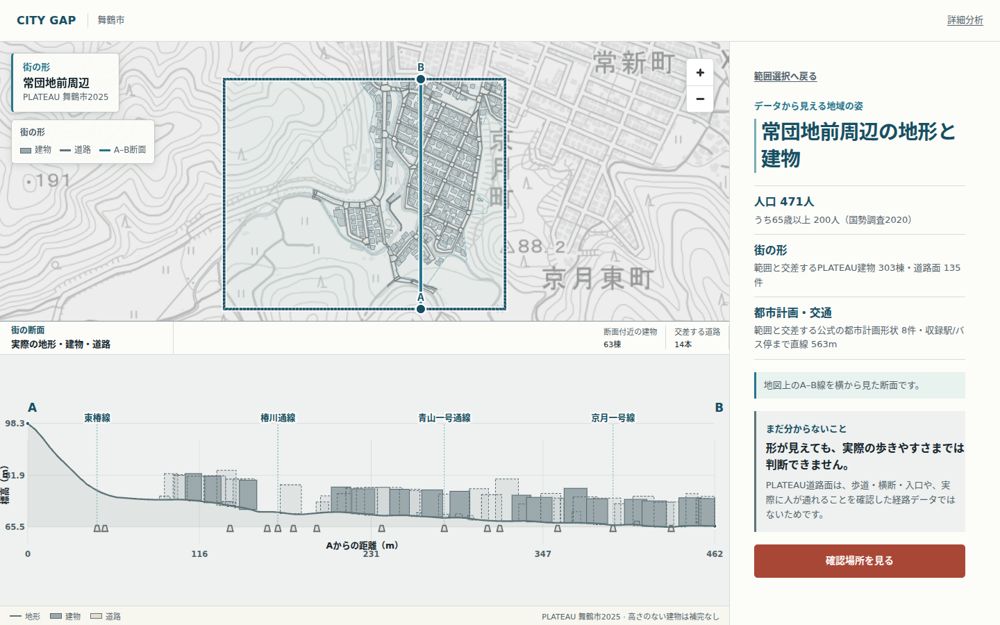

# CITY GAP

**地域の「まだ分からない」を、地図から現地確認へつなぐ空間調査プロダクト。**

[公開デモ](https://catlover-bot.github.io/plateau-city-gap/) · [現在のドキュメント](docs/README.md) · [プロダクト境界](docs/data-and-claim-boundaries.md) · [構成](docs/architecture.md)

CITY GAPは、舞鶴市の公開データとPLATEAUを使い、地域の候補を見つけ、街の形を理解し、現地で確かめる対象を具体化します。公開面は地図を中心にした3シーンのGuided体験です。Advanced面では、同じ選択と表示状態を保ったまま詳細分析へ移れます。



## Product flow

```text
地域を選ぶ
  → PLATEAUの建物・道路・地形を同じ場所で読む
  → 実在する対象、登録地点、または正直な範囲fallbackを選ぶ
  → データだけでは決められない3–5項目を現地で確かめる
```

- 市内495の500m Areaから、地図と一覧で調査範囲を選べます。
- 詳細な建物・道路・都市計画・Urban Sectionは、選択したAreaだけ遅延読込します。
- PLATEAU対象を解決できる場合は実在する建物または道路面を示します。
- 個別対象を解決できない場合はArea fallbackとして表示し、正確な地点を装いません。
- Urban Sectionは地図上のA–B線と同じ位置を、実DEM・建物・道路の断面として示します。
- GuidedからAdvancedへの移行は単一のbounded loadで、失敗時のretryと選択状態の保持を備えます。

分析結果は候補探索と確認準備のためのものです。危険度、政策推奨、施策優先順位、歩行時間、実居住者数、現地確認結果を自動決定しません。詳しくは[データと主張の境界](docs/data-and-claim-boundaries.md)を参照してください。

## Repository

- `analysis/`: 公式入力の設定、決定論的分析、検証、公開asset生成
- `frontend/`: React、MapLibre、Cesium、Guided / Advanced / Municipal surfaces
- `backend/`: FastAPI、adapter、worker、audit log
- `infra/`: PostGIS schema、deployment、operations
- `docs/`: 現在の設計、データ境界、検証、運用、プレゼンテーションasset

`analysis/outputs/real/` が分析結果のSSOTです。ブラウザは公開可能な静的assetを読み、人口・距離・スコアを再計算しません。大容量raw CityGMLと再生成可能な中間成果物はGit管理外です。

## Run the frontend

Node.js 20以降:

```bash
cd frontend
npm ci
npm run dev
```

Production相当:

```bash
npm run build
npm run preview
```

Municipal surface:

```bash
VITE_CITYGAP_SURFACE=municipal npm run build
```

## Validate

```bash
npm --prefix frontend run lint
npm --prefix frontend run typecheck
npm --prefix frontend run test -- --run
npm --prefix frontend run build
npm --prefix frontend run check:docs
```

Python 3.10以降:

```bash
python -m pip install -e '.[dev]'
python -m analysis.scripts.run_final_audit
pytest -q
```

ブラウザのGuided回帰、Guided → Advanced移行、PLATEAU-native、visual identity、accessibility、capture手順は[QA](docs/qa.md)と[プレゼンテーションasset](docs/presentation-assets.md)にまとめています。

## Documentation

まず[docs/README.md](docs/README.md)を参照してください。主要SSOTは次のとおりです。

- [Architecture](docs/architecture.md)
- [Product domain](docs/product-domain.md)
- [Data sources](docs/data-sources.md)
- [Methodology](docs/methodology.md)
- [Evidence chain](docs/evidence-chain.md)
- [Urban Section](docs/urban-section.md)
- [Security](docs/tenant-security.md)
- [Deployment](docs/deployment.md)

## Deployment boundary

Vite base pathは `/plateau-city-gap/` です。このfeature branchは`main`へ未統合です。mainへのmerge、force push、またはmainをこのbranchへ取り込む操作は、明示的な承認なしに行いません。

## License

コードと各データのlicenseは[LICENSE](LICENSE)と[データ出典](docs/data-sources.md)を参照してください。自治体の最終判断には現地確認、関係部署レビュー、最新原典の確認が必要です。
