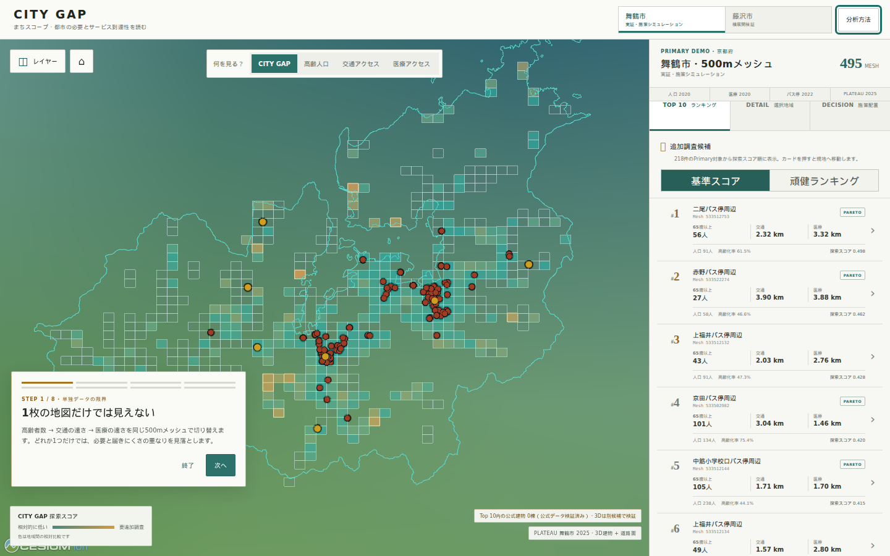

# CITY GAP

まちの「必要」と「サービスの届き方」のズレを見つける

**Team まちスコープ — Project PLATEAU CityHack Challenge 2026**
最終発表: 2026-09-05

[Webデモ](https://catlover-bot.github.io/plateau-city-gap/) · [4分デモ台本](docs/demo-script.md) · [発表用の固定数字](docs/presentation-facts.md) · [Robustness](docs/robustness.md) · [配置最適化](docs/intervention-optimization.md) · [Network scenario](docs/network-scenarios.md) · [自治体scenario workspace](docs/scenario-workspace.md) · [Multi-city registry](docs/multi-city-registry.md) · [PLATEAU文脈](docs/plateau-context.md) · [Evidence Chain](docs/evidence-chain.md) · [想定Q&A](docs/qa.md)

このリポジトリには、審査・公開用の静的な **Competition Demo** と、段階的に構築中の **Urban Digital Twin Platform** の2系統があります。静的デモとGitHub Pagesは従来どおりバックエンドなしで動作します。PlatformはPLATEAU CityGML全量取込に加え、Priority 2として実建物への人口配賦と建物起点アクセシビリティを実装しています。



## Problem

人口、高齢化、公共交通、医療施設はそれぞれ別の地図として公開されています。しかし、地域のニーズが大きい場所とサービスへ到達しにくい場所を重ねて見なければ、単独の地図では追加調査すべき候補を見落とします。

CITY GAPは「都市計画の目標値と現実の差」や「行政が認定した課題」を判定するものではありません。今回のMVPが扱うのは、**人口・高齢者数という地域ニーズと、公共交通・医療への到達しやすさの空間的なミスマッチ**です。

## Solution

舞鶴市の実データを500mメッシュ単位で統合し、課題候補の発見から条件感度、複数施策案の比較、根拠確認までを1つのブラウザ体験にしました。同じ設定駆動エンジンを藤沢市の実データへ適用し、都市横断で動くことも検証しています。

- 495メッシュを「CITY GAP」「65歳以上人口」「公共交通距離」「医療距離」で切り替えて比較
- Primary条件を満たす218メッシュから追加調査候補Top 10を表示
- 実測値、最寄り施設、percentileを分解した決定論的な「なぜ？」説明
- 9つの分析条件でTop 10 / Top 20への残り方を示すRobustness View
- CesiumJS上で公式PLATEAU 2025の3D建物と実属性を確認
- 11,460のPLATEAU道路LOD1面候補から仮想交通支援拠点1〜3地点を比較
- 全体改善・取り残し重視・頑健候補の3目的とBefore / Afterを比較
- 距離・Score・配置案を公式データ、CRS、式、丸め前値まで辿るEvidence Chain
- データ年次、計算方法、除外条件、限界をアプリ内で開示
- 藤沢市327メッシュ、Top 10、WHYを横展開検証モードで表示（3D・What-ifは舞鶴市のみ）

スコアは政策判断の正解や危険度ではなく、現地確認・ヒアリング・施策検討を始めるための探索用指標です。

人口「人」と距離「m」は絶対値です。percentileとScore Cは各都市の比較母集団内だけで意味を持つ相対値です。画面は絶対値を先に示し、都市内相対位置を補助表示します。舞鶴と藤沢のScore値を直接比較しません。

## Demo

Webデモを開き、地図上の `デモを見る` を押すと次の8ステップを順に進めます。

1. 単独データでは見えない
2. CITY GAPで発見
3. 分析条件を変えても残るか確認
4. PLATEAUで都市空間を確認
5. 1地点なら
6. 2地点なら
7. 全体改善 vs 取り残し重視
8. 藤沢市でも同じEngineを再現

3D建物の公式整備範囲とTop 10は重なっていません。Step 4は、同じ286メッシュの比較で全市23位、公式建物296棟を確認できる候補へ移動します。**Top 10内0棟はPLATEAUへの批判ではなく、年度・整備範囲・LOD方針を含む都市データの空白を発見した結果**として扱います。発表時の操作と話す内容は [docs/demo-script.md](docs/demo-script.md) にまとめています。

## How it works

```text
都市別YAML設定 + 公式rawデータ
  └─ 共通Python / GeoPandas分析（舞鶴 EPSG:6674 / 藤沢 EPSG:6677）
       ├─ Robustness 9条件 + 11,460道路候補の事前最適化
       └─ analysis/outputs/real/  ← 分析値のSingle Source of Truth
            └─ 検証付きWeb asset生成
                 └─ frontend/public/data/
                      └─ React + TypeScript + CesiumJS（静的配信）
                           ├─ 事前計算済み1/2/3地点案の比較
                           └─ ブラウザ内の任意1地点What-if再計算
```

分析値をフロントエンドへ手入力していません。`run_city_analysis.py` は `analysis/config/maizuru.yaml` / `fujisawa.yaml` を読み、同じ処理で成果物を生成します。Web asset builderはTop 10の順位、mesh codeの一意性、人口・距離・座標・geometry、元分析との対応を検証します。詳細は [architecture](docs/architecture.md)、[methodology](docs/methodology.md)、[cross-city validation](docs/cross-city-validation.md) を参照してください。

## Real findings

2026-08-22時点の取得データでは、舞鶴市境界と交差する人口メッシュは495件です。秘匿・合算影響のない286件でpercentileを計算し、そのうち人口20人以上・65歳以上10人以上の218件をランキング対象にしました。

Rank 1はmesh `533512753`です。

| 指標 | 実データ値 |
|---|---:|
| 人口 | 91人 |
| 65歳以上人口 / 高齢化率 | 56人 / 61.5% |
| 最寄り公共交通 | 二尾バス停 2,322m |
| 最寄り駅 | 東雲駅 2,868m |
| 最寄り医療機関 | 隅山医院 3,317m |
| 最寄り病院 | 舞鶴赤十字病院 4,493m |
| CITY GAP探索スコア C | 0.498 |
| Pareto frontier | yes |

これはサービス不足や施策優先順位の確定ではありません。直線距離では捉えられない運行頻度、道路、坂、送迎、施設能力、現地の生活実態を追加調査する入口です。Top 10全件は [findings](docs/findings.md)、定義・分母・variant・Pareto・市境感度は [Score監査](docs/score-audit.md) に掲載しています。

藤沢市では、市境と交差する327メッシュ、都市内比較263メッシュ、Primary順位対象261メッシュを処理しました。Top 1は `533913073`「県営サンハイツ渋谷前バス停周辺」で、人口3,590人、65歳以上921人、交通593m、医療734mです。市外2km・一般利用不明の医療を除く感度では交通346m・医療506mとなり、Rank 1は維持、Top 10は7/10一致でした。絶対距離と都市内percentileの読み分け、企業健康管理室等のfalse positive確認は [2都市の実データ検証](docs/cross-city-validation.md) と [Score監査](docs/score-audit.md) に記録しています。

## Why PLATEAU

PLATEAUは装飾的な背景としてだけ使っていません。

- 舞鶴市の行政界と駅データを分析対象の抽出・距離計算に利用
- 公式配布2025年3D Tiles全427ファイルを検査し、配布内44,640棟の一意な建物と属性実装率を確認
- CITY GAP計算対象286件のうち公式建物が1棟以上ある154メッシュを抽出し、上位5件を公開
- 全市23位「常団地前バス停周辺」の公式leaf tile 3件・856棟（対象メッシュ内296棟）を4.31MBの静的subsetとしてCesiumに表示
- 用途・計測高さ・地上/地下階数・建築面積・延べ面積・実LODを、存在する値だけクリック時に表示
- 公式CityGMLの道路LOD1面135件をDeep Diveへ重ね、道路面上から配置探索アンカーを生成
- 44,640棟の実CityGML用途・床面積・footprintを監査し、秘匿影響のない149meshで住宅建物へ人口を配賦
- 住宅建物代表点から交通・医療への直線距離を計算し、500m中心と建物加重平均・中央値・p90を比較
- 公式DEM TIN 20,965三角形から対象メッシュの標高と局所勾配を要約（歩行経路勾配とは呼ばない）
- CityGML全8テーマ97,140地物をinventoryし、土地利用31,067・都市計画394・土砂4,643・洪水666・津波23地物を公式コード表付きで分析へ接続
- 土地利用・都市計画・災害を住宅建物28,448棟、495メッシュ、施策候補11,460地点へ空間結合し、災害を「追加確認が必要」として分離表示
- 道路LOD1面15,684から実験的面隣接graph（23,437辺）を生成し、建物起点network距離とDEM上り・下りを直線距離とは別に計算
- Top 10との空間照合が0棟だったことを、欠損を補間せず「公式建物モデルの整備範囲外」として提示

現行の全市Screeningスコアは変更していません。第二段階のPLATEAU Detailでは、建物用途・正確なmesh交差・延べ面積が人口配賦を、建物代表点が交通・医療の加重距離を直接変えます。推計は実居住者ではなく、秘匿影響meshを建物へ分解しません。道路面隣接距離は公式歩行者networkではなく、横断・歩道・通行可否を保証しません。方法は [建物人口配賦](docs/building-population.md)、[用途監査](docs/building-usage.md)、[建物アクセシビリティ](docs/building-accessibility.md)、[network accessibility](docs/network-accessibility.md)、[PLATEAU文脈](docs/plateau-context.md) を参照してください。

## CITY GAP Decision Studio

`施策配置` では、公式PLATEAU道路LOD1面から抽出した11,460候補を事前計算し、1〜3地点、全体改善・取り残し重視・頑健候補を比較します。任意の1地点を地図で試す従来What-ifも維持しています。座標をWGS84からJGD2011 / 平面直角座標系VI（EPSG:6674）へ変換し、分析と同じユークリッド直線距離で次を計算します。

```text
after_transport_distance
  = min(baseline_transport_distance, distance_to_virtual_point)
```

286件の比較対象で交通距離percentileを再計算し、高齢者数percentileと医療距離percentileを固定したままScore Cを再計算します。計算は決定論的で、固定のBefore / After値は使いません。

全体改善案は既存駅・バス停から150m超、候補間1.5km以上という条件で、286メッシュのScore C合計純減少を重視します。1地点は候補集合内のexact探索、2/3地点は決定論的forward greedy近似で、全組合せの最適解ではありません。1地点は5メッシュ・65歳以上記録人口241人・平均532.856m短縮、2地点は7メッシュ・377人・448.902m、3地点は9メッシュ・654人・422.785mです。詳細とfairness trade-offは [配置最適化](docs/intervention-optimization.md) を参照してください。

`Rank 1中心で試す` の0mシナリオは診断用の折りたたみ内に残し、Primaryデモには使いません。

## Data

| データ | 年次 | Web/分析での件数 | 用途 |
|---|---:|---:|---|
| e-Stat 令和2年国勢調査 500mメッシュ | 2020 | 舞鶴市交差495、percentile対象286 | 人口、65歳以上人口 |
| 国土数値情報 P11 バス停 | 2022 | 舞鶴市151 | 公共交通距離 |
| 国土数値情報 P04 医療機関 | 2020 | 舞鶴市105、距離対象71 | 医療距離 |
| PLATEAU 舞鶴市関連データ | 2025 | 駅7地点、行政界1 | 駅距離、対象範囲 |
| PLATEAU 舞鶴市 CityGML / 3D Tiles | 2025 | 全8テーマ97,140地物、建物44,640、道路15,684、土地利用31,067、都市計画394、災害5,332 | 3D実属性、人口配賦、道路network・DEM、土地利用・計画・災害文脈 |
| e-Stat / P11 / P04 藤沢市 | 2020 / 2022 | mesh 327、バス停446、医療718（距離対象436） | 横展開検証 |
| PLATEAU 藤沢市関連データ | 2025 | 駅20地点、行政界1 | 駅距離、対象範囲 |

出典URL、チェックサム、加工内容、属性実装率は [data-sources](docs/data-sources.md) に記録しています。大容量rawデータはGit管理外です。

## Architecture

- `analysis/config/`: 都市コード、CRS、公式入力、閾値、出力先
- `analysis/src/run_city_analysis.py`: 都市非依存の共通runner
- `analysis/src/`: mesh、CRS変換、距離、指標、ランキング
- `analysis/outputs/real/`: 確定した実分析結果
- `analysis/scripts/build_web_assets.py`: 公開データの検証・変換
- `analysis/scripts/download_plateau_3d.py`: 公式3D Tilesのchecksum検証付き取得・安全な展開
- `analysis/scripts/inspect_plateau_buildings.py`: LOD1/LOD2全tileとTop 10 coverageの決定論的検査
- `analysis/scripts/build_plateau_web_subset.py`: 検証済み公式3D Tilesから参照subsetを再生成
- `analysis/scripts/build_final_demo_assets.py`: PLATEAU-covered候補、道路面Top 3、DEM・Deep Dive assetを再生成
- `analysis/scripts/build_decision_studio_assets.py`: Robustnessと1/2/3地点・3目的の配置案を事前計算
- `analysis/scripts/verify_decision_studio.py`: 全9案の距離・Score・Evidenceを独立再計算
- `frontend/public/data/`: 軽量化した静的GeoJSON/JSONとPLATEAU subset
- `frontend/src/`: React UI、Cesium地図、決定論的説明、What-if
- `backend/citygap_platform/`: CityGMLストリーミング取込、PostGIS loader、FastAPI
- `infra/migrations/`: dataset version・provenance・PLATEAU typed table
- `docker-compose.yml`: PostGIS / pgRouting、API、静的frontendのローカル構成
- `.github/workflows/deploy-pages.yml`: GitHub Pages build/deploy

Competition Demoにはバックエンド、データベース、API keyは不要です。Viteのbase pathは `/plateau-city-gap/` です。Platform設計は [platform architecture](docs/platform-architecture.md)、全量取込は [PLATEAU ingestion](docs/plateau-ingestion.md) を参照してください。

## Run locally

Node.js 20以降を用意してください。

```bash
git clone https://github.com/catlover-bot/plateau-city-gap.git
cd plateau-city-gap/frontend
npm ci
npm run dev
```

表示されたローカルURLをブラウザで開きます。プロダクション相当は `npm run build && npm run preview` で確認できます。

### Urban Digital Twin Platform

Dockerが利用できる環境では、PostGIS / pgRouting、API、既存frontendをまとめて起動できます。

```bash
cp .env.example .env
# 共有環境ではCITYGAP_POSTGRES_PASSWORDを必ず変更
docker compose up --build
```

frontendは `http://localhost:8080/plateau-city-gap/`、API仕様は `http://localhost:8000/docs` です。raw CityGMLはGit管理外のまま、別ターミナルから次を実行します。

```bash
python -m pip install -e '.[platform]'
python -m analysis.scripts.build_plateau_inventory
python -m analysis.scripts.ingest_plateau_postgis
python -m analysis.scripts.load_building_demographics_postgis \
  --dataset-version-id UUID --database-url "$CITYGAP_DATABASE_URL"
python -m analysis.scripts.build_plateau_context
python -m analysis.scripts.verify_plateau_context
python -m analysis.scripts.load_plateau_context_postgis \
  --database-url "$CITYGAP_DATABASE_URL"
```

Priority 2の正規計算はPostGIS不要で、PyArrow Parquetを生成してから同じ値をloaderがupsertします。
この環境ではDB投入を実行せず、migration/SQL契約をunit testしています。APIは大量geometryの無制限配信を行わず、建物取得にbboxと最大1,000件のlimitを要求し、詳細endpointは単一meshまたは単一建物だけを返します。

## Reproduce analysis

Python 3.10以降と、公式配布元へ接続できる環境が必要です。

```bash
python3 -m venv .venv
. .venv/bin/activate
python -m pip install -e '.[dev]'
python -m analysis.scripts.download_real_data --city all
python -m analysis.src.run_city_analysis --config analysis/config/maizuru.yaml
python -m analysis.src.run_city_analysis --config analysis/config/fujisawa.yaml
python -m analysis.scripts.download_plateau_3d
python -m analysis.scripts.inspect_plateau_buildings
python -m analysis.scripts.build_final_demo_assets
python -m analysis.scripts.build_plateau_web_subset
python -m analysis.scripts.run_final_audit
SOURCE_DATE_EPOCH=1787392800 python -m analysis.scripts.build_web_assets
SOURCE_DATE_EPOCH=1787392800 python -m analysis.scripts.build_decision_studio_assets
python -m analysis.scripts.verify_decision_studio
python -m analysis.scripts.build_building_demographics
python -m analysis.scripts.verify_building_demographics
python -m analysis.scripts.build_plateau_context
python -m analysis.scripts.verify_plateau_context
python -m analysis.scripts.build_network_scenarios --max-sites 5
python -m analysis.scripts.verify_network_scenarios
python -m analysis.scripts.build_scenario_canonical
python -m analysis.scripts.build_platform_registry
SOURCE_DATE_EPOCH=1787392800 python -m analysis.scripts.build_city_validation_assets \
  --config analysis/config/fujisawa.yaml \
  --output-dir frontend/public/data/cities/fujisawa
```

`download_plateau_3d` は160,582,905 bytesの公式ZIPを固定SHA-256で検証し、LOD1/LOD2建物containerだけを安全に展開します。`inspect_plateau_buildings` は全854 b3dmを走査します。final demo builderは取得済みCityGMLから建物・道路・DEMを実データのまま集計し、subset builderは公開する3 b3dmを公式ZIP内memberへhash照合します。

約161MBの3D Tiles ZIP、約914MBのCityGML ZIPと展開物は `data/raw/` に保持しGitへ追加しませんが、検査結果と約4.32MBのWeb subsetは追跡対象です。最後の `SOURCE_DATE_EPOCH` はtracked manifestの生成時刻を固定するための値で、分析値には影響しません。

## Tests

```bash
. .venv/bin/activate
pytest
ruff check .

cd frontend
npm ci
npm run lint
npm run typecheck
npm run test
npm run build
```

Pythonテストはmesh復号、空間抽出、距離、指標、秘匿処理、2都市、Robustness、1/2/3地点、fairness、候補間隔、独立再計算を対象にします。Vitest 22テストは2都市の読み込み、表示整形、任意What-ifに加え、Robustness View、目的・地点数切替、Before / After、Evidence Chain、禁止表現を対象にします。

PlatformテストはCityGMLのstream境界、`gml:id`一意性、軸順変換、LOD・属性、建物用途・面交差・保存・加重分位、道路network、DEM、土地利用・都市計画・災害、PostGIS migration、bbox必須APIと単一建物/mesh詳細契約を対象にします。

## Data protection

現段階で個人情報を扱いません。building-level populationは500m統計を建物属性で按分した**モデル推計値**であり、実在個人・世帯・住民票・確認済み入居のデータではありません。秘匿・合算影響meshは建物へ分解せず、詳細ParquetはGit管理外、公開デモは500m集計だけです。推計人口を実人数と呼ばず、原統計、配分法、解像度をprovenanceとして保持します。秘密情報・自治体内部データ・`.env`をリポジトリへ追加しないでください。

## Limitations

- 距離は500mメッシュ中心から施設までの直線距離で、徒歩・道路・所要時間ではありません。
- 公共交通の頻度、デマンド交通、高速・長距離バス、施設送迎を評価しません。
- 医療施設の診療能力、一般利用可否、現在の開設状況を保証しません。
- 施設検索baselineは市内収録点に限定します。市外2km感度を併記しますが、都道府県境を越える全施設・隣接都市の全駅を含む完全な生活圏ではありません。
- 人口・医療は2020年、バス停は2022年、PLATEAUは2025年で時点が一致しません。
- percentileは各都市内の相対比較であり、舞鶴市と藤沢市のScoreを直接比較できません。
- 秘匿・合算影響のある209メッシュは表示しますが、percentileとランキングから除外します。
- PLATEAU 3D subsetは全市23位のDeep Dive範囲だけで、舞鶴市全域でもTop 10周辺でもありません。
- 道路LOD1 15,684面から実験的な面隣接graph（23,437辺）を生成し、建物加重Euclideanとの比較成果物を追加しました。これは公式歩行者networkではなく、歩道・横断・通行可否を持ちません。既存What-if効果は引き続き直線距離で、network-aware scenarioとは分離しています。
- PLATEAU DEM TIN 16,310,504三角形を道路nodeへ照合し、距離とは別にrouteの上り・下り・最大観測gradeを出力します。道路中心線の測量勾配や歩行energyではありません。
- DEM勾配はTIN三角形の局所要約で、歩行経路の坂を表しません。
- What-ifは用地、運行可能性、需要、費用を評価しません。
- Robustness頻度は、定義した9条件内で候補が残る回数であり、確率・信頼度ではありません。
- 2/3地点案は決定論的greedy近似で、大域的最適解ではありません。費用データがないためROIは扱いません。

## License / attribution

ソフトウェアコードは [MIT License](LICENSE) です。これは同梱・加工データへMITを適用するものではありません。データには各配布元の条件が別途適用されます。

- e-Stat「令和2年国勢調査」を加工して作成（統計GIS利用規約、政府標準利用規約2.0 / CC BY 4.0互換）
- 国土交通省「国土数値情報 P11/P04」を加工して作成（国土数値情報利用約款）
- Project PLATEAU「3D都市モデル（舞鶴市）2025年度」および関連データを加工して使用（PLATEAU Site Policy）
- 背景地図はCesium同梱のNatural Earth II静的タイルを使用（外部地図APIへの実行時依存なし）

個別の公式URLと利用上の注意は [docs/data-sources.md](docs/data-sources.md) を参照してください。
