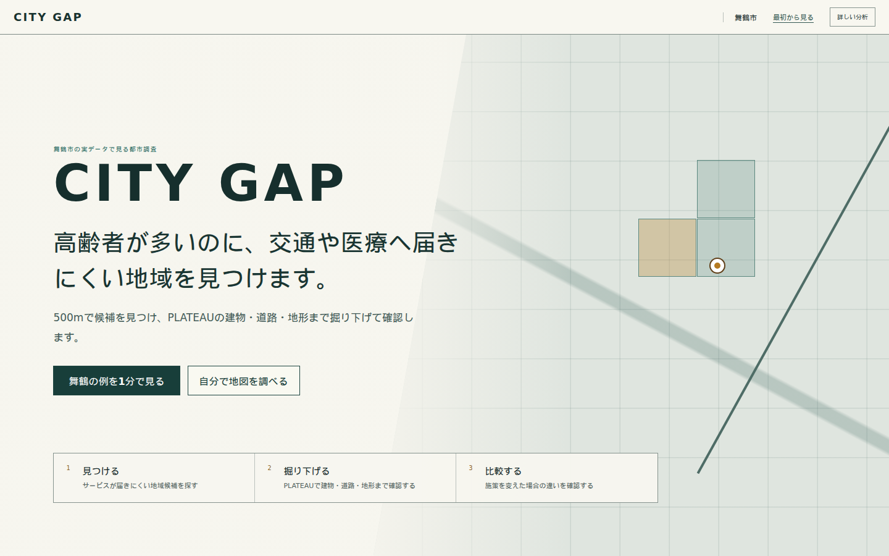

# CITY GAP

高齢者が多いのに、交通や医療へ届きにくい地域を見つけます。

500mで候補を見つけ、PLATEAUの建物・道路・地形まで掘り下げて確認します。

[Public Showcase](https://catlover-bot.github.io/plateau-city-gap/) · [Product vision](docs/product-vision.md) · [Architecture](docs/architecture.md) · [Data and methodology](docs/methodology.md)

CITY GAPは、人口・高齢者数と公共交通・医療への到達しやすさを500mメッシュで重ね、追加調査候補を見つけます。結果は危険度、施策優先順位、居住者個人の実数を示しません。候補を選んだ後は、同じFindingと選択を保ったままPLATEAUの都市objectへ解像度を上げ、施策比較とEvidenceへ接続します。



## What it does

- 舞鶴市495メッシュと藤沢市327メッシュを同じ決定論的pipelineで分析
- 都市 → 地区 → 500m → 建物群 → 建物 → 道路 → 施策のResolution Lift
- PLATEAU建物・道路LOD1面・実DEMを同じ調査sceneで表示
- 296棟・道路135・実TINを固定するcontent-addressed Spatial Evidence Pack
- 同じ選択を3Dと実DEM断面で同期するPLATEAU Urban Section
- 既存のCITY GAP計算値だけを使うUrban X-Ray
- 実network距離だけを表示するService Pulse
- Baseline / Scenario / Stressのchanged-only Counterfactual Twin
- 公開済み実sampleだけを表示するTemporal PLATEAU Ghost
- Finding → PLATEAU objectと、object → Findingの双方向Object Lens
- Source、year、計算、限界を辿れるEvidence Chain
- 認証済みMunicipal Service、PostGIS / pgRouting、API、worker、field offline sync

## Why PLATEAU

Open Dataは課題候補を発見し、PLATEAUは候補を実際の都市構造まで詳細化します。PLATEAUは背景レイヤーではなく、CITY GAPのUrban Object Modelです。

```text
Open Data Finding
  └─ 500m mesh
      ├─ contains → PLATEAU building group / building
      ├─ intersects → PLATEAU road surface
      ├─ explained by → PLATEAU DEM
      └─ context → land use / planning / hazard
           └─ CITY GAP analysis / scenario / evidence
```

舞鶴市2025 PLATEAUでは全市配信44,640建物を確認し、常団地前Deep Diveには検証済み856棟subset、対象メッシュ内296棟、道路LOD1面、実TIN DEMを収録しています。Top 10メッシュの公式建物coverageは0棟であり、欠損を補間せず表示します。

建物人口はモデル推計配分であり、実居住者数ではありません。公開画面では建物別人口を表示せず、秘匿・抑制対象メッシュを建物へ分解しません。道路graphは `experimental PLATEAU LOD1 road-surface adjacency` であり、歩行者network、歩行距離、歩行時間ではありません。DEMから歩行負荷・危険度・斜度を推定しません。

## Architecture

```text
Official data / versioned manifests
  └─ Python analysis + independent verification
      └─ analysis/outputs/real (analysis SSOT)
          ├─ privacy-reviewed static web assets
          │   └─ React + MapLibre + Cesium
          └─ PostGIS / pgRouting
              └─ FastAPI + worker + audit log
```

主要ディレクトリ:

- `analysis/config/`: 都市別の公式入力、CRS、閾値
- `analysis/src/`: 都市共通の分析engine
- `analysis/outputs/real/`: 確定した実分析結果
- `analysis/scripts/`: download、asset build、独立検証、benchmark
- `frontend/src/map/`: 2D / 3D / scene / layer / readiness
- `frontend/src/state/spatial/`: URL共有可能な空間state
- `frontend/src/service/`: Municipal Service
- `backend/citygap_platform/`: API、adapter、worker
- `infra/migrations/`: versioned PostGIS schema

詳細は [architecture](docs/architecture.md)、[3D rendering](docs/3d-rendering.md)、[API contract](docs/api-contract.md) を参照してください。

## Run

Node.js 20以降:

```bash
cd frontend
npm ci
npm run dev
```

production相当:

```bash
npm run build
npm run preview
```

Municipal Service surface:

```bash
VITE_CITYGAP_SURFACE=municipal npm run build
npm run preview
```

PostGIS / pgRouting、API、workerを含む構成:

```bash
cp .env.example .env
# 共有環境ではCITYGAP_POSTGRES_PASSWORDを変更
docker compose up --build
```

## Reproduce and validate

Python 3.10以降:

```bash
python -m pip install -e '.[dev]'
python -m analysis.src.run_city_analysis --config analysis/config/maizuru.yaml
python -m analysis.src.run_city_analysis --config analysis/config/fujisawa.yaml
python -m analysis.scripts.run_final_audit
python -m analysis.scripts.verify_decision_studio
python -m analysis.scripts.verify_network_scenarios
python -m analysis.scripts.build_spatial_evidence_pack
pytest -q
```

Frontend:

```bash
npm --prefix frontend run lint
npm --prefix frontend run typecheck
npm --prefix frontend test -- --run
npm --prefix frontend run build
```

正規スクリーンショットはproduction buildのGuided Investigationを実際に完走して生成します。各画面の問い、実データ値、都市断面、主操作、viewport、critical requestを検証し、8枚すべてが揃ったstageだけを公開します。3Dの準備中は検証済み都市断面を正直に表示し、manifestへ表示経路を記録します。

```bash
npm --prefix frontend run capture:current -- \
  --url http://127.0.0.1:4173/plateau-city-gap/
```

出力は `docs/assets/current/` の8枚と `manifest.json` だけです。失敗時は既存currentを保持し、`analysis/outputs/real/visual-readiness-failures/` に診断JSONを保存します。Cesiumの完全読込を要求する従来の高度分析captureは `capture:advanced` として分離しています。

## Current documentation

- [Product vision](docs/product-vision.md)
- [Architecture](docs/architecture.md)
- [Visual system](docs/visual-system.md)
- [3D rendering](docs/3d-rendering.md)
- [Methodology](docs/methodology.md)
- [Data sources](docs/data-sources.md)
- [Validation evidence](docs/validation-evidence.md)
- [First-run comprehension test](docs/first-run-comprehension-test.md)
- [Operations](docs/operations.md)
- [Security](docs/tenant-security.md)

データの出典、checksum、年次、加工、licenseは [data sources](docs/data-sources.md) に記録しています。大容量raw CityGMLはGit管理外です。

## License

コードと各データのlicenseは [LICENSE](LICENSE) と [data sources](docs/data-sources.md) を参照してください。自治体の最終判断には現地確認、関係部署レビュー、最新原典の確認が必要です。
