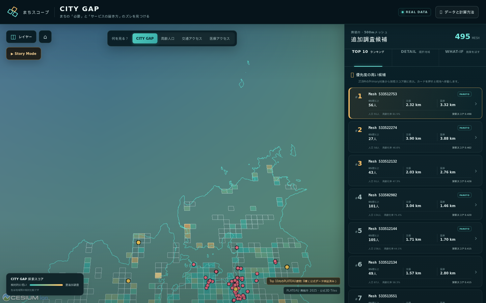

# CITY GAP

まちの「必要」と「サービスの届き方」のズレを見つける

**Team まちスコープ — Project PLATEAU CityHack Challenge 2026**
最終発表: 2026-09-05

[Webデモ](https://catlover-bot.github.io/plateau-city-gap/) · [4分デモ台本](docs/demo-script.md) · [審査観点との対応](docs/judging.md)



## Problem

人口、高齢化、公共交通、医療施設はそれぞれ別の地図として公開されています。しかし、地域のニーズが大きい場所とサービスへ到達しにくい場所を重ねて見なければ、単独の地図では追加調査すべき候補を見落とします。

CITY GAPは「都市計画の目標値と現実の差」や「行政が認定した課題」を判定するものではありません。今回のMVPが扱うのは、**人口・高齢者数という地域ニーズと、公共交通・医療への到達しやすさの空間的なミスマッチ**です。

## Solution

舞鶴市の実データを500mメッシュ単位で統合し、発見から検証までを1つのブラウザ体験にしました。

- 495メッシュを「CITY GAP」「65歳以上人口」「公共交通距離」「医療距離」で切り替えて比較
- Primary条件を満たす218メッシュから追加調査候補Top 10を表示
- 実測値、最寄り施設、percentileを分解した決定論的な「なぜ？」説明
- CesiumJS上で公式PLATEAU 2025の3D建物と実属性を確認
- 仮想交通支援拠点を置き、距離と探索スコアのBefore / Afterをその場で再計算
- データ年次、計算方法、除外条件、限界をアプリ内で開示

スコアは政策判断の正解や危険度ではなく、現地確認・ヒアリング・施策検討を始めるための探索用指標です。

## Demo

Webデモを開き、画面上部の `Story Mode` を押すと次の4ステップを順に再生できます。

1. 課題を発見
2. なぜ？
3. PLATEAUで現地を見る
4. 施策を試す

3D建物の公式整備範囲とTop 10は重なっていません。Step 3は東舞鶴駅・西舞鶴駅周辺の実在するPLATEAU建物へ移動し、**Top 10内の公式建物モデルが0棟だったというデータ範囲の事実**も隠さず表示します。発表時の操作と話す内容は [docs/demo-script.md](docs/demo-script.md) にまとめています。

## How it works

```text
公式rawデータ
  └─ Python / GeoPandas分析（EPSG:6674）
       └─ analysis/outputs/real/  ← 分析値のSingle Source of Truth
            └─ 検証付きWeb asset生成
                 └─ frontend/public/data/
                      └─ React + TypeScript + CesiumJS（静的配信）
                           └─ ブラウザ内What-if再計算
```

分析値をフロントエンドへ手入力していません。`build_web_assets.py` はTop 10の順位、mesh codeの一意性、人口・距離・座標・geometry、元分析との対応を検証してから公開用GeoJSON/JSONを生成します。詳細は [architecture](docs/architecture.md) と [methodology](docs/methodology.md) を参照してください。

## Real findings

2026-08-22時点の取得データでは、舞鶴市境界と交差する人口メッシュは495件です。秘匿・合算影響のない286件でpercentileを計算し、そのうち人口20人以上・65歳以上10人以上の218件をランキング対象にしました。

Rank 1はmesh `533512753`です。

| 指標 | 実データ値 |
|---|---:|
| 人口 | 91人 |
| 65歳以上人口 / 高齢化率 | 56人 / 61.5% |
| 最寄り公共交通 | 二尾バス停 2,322m |
| 最寄り駅 | 東雲駅 2,868m |
| 最寄り医療機関 | 隅山医院 3,317m |
| 最寄り病院 | 舞鶴赤十字病院 4,493m |
| CITY GAP探索スコア C | 0.498 |
| Pareto frontier | yes |

これはサービス不足や施策優先順位の確定ではありません。直線距離では捉えられない運行頻度、道路、坂、送迎、施設能力、現地の生活実態を追加調査する入口です。Top 10全件は [findings](docs/findings.md) に掲載しています。

## Why PLATEAU

PLATEAUは装飾的な背景としてだけ使っていません。

- 舞鶴市の行政界と駅データを分析対象の抽出・距離計算に利用
- 公式配布2025年3D Tiles全427ファイルを検査し、配布内44,640棟の一意な建物と属性実装率を確認
- 東舞鶴駅・西舞鶴駅周辺の公式leaf tile 5件を12.7MBの静的配信用subsetとしてCesiumに表示
- subset内2,152棟について、実在する用途・計測高さ・階数・LODだけをクリック時に表示
- Top 10との空間照合が0棟だったことを、欠損を補間せず「公式建物モデルの整備範囲外」として提示

subsetはTop 10周辺を装うものではなく、公式3D建物が存在する市街地の参照範囲です。現行スコアへ建物形状を入力してはいません。建物単位の居住起点や道路・勾配を使う高度化は今後の検証事項です。

## What-if simulation

`施策を試す` では地図上に仮想交通支援拠点を1点置きます。クリック座標をWGS84からJGD2011 / 平面直角座標系VI（EPSG:6674）へ変換し、分析と同じユークリッド直線距離で次を計算します。

```text
after_transport_distance
  = min(baseline_transport_distance, distance_to_virtual_point)
```

286件の比較対象で交通距離percentileを再計算し、高齢者数percentileと医療距離percentileを固定したままScore Cを再計算します。計算は決定論的で、固定のBefore / After値は使いません。

再現用の `Rank 1中心で試す` では、Rank 1の交通距離が2,321.66mから0m、Score Cが0.498135から0.001916になります。距離が短くなるのは2メッシュで、その2メッシュの65歳以上人口合計は64人です。この64人は利用者数や便益人口の予測ではありません。また、メッシュ中心への仮想配置は計算確認用であり、実際の設置提案ではありません。

## Data

| データ | 年次 | Web/分析での件数 | 用途 |
|---|---:|---:|---|
| e-Stat 令和2年国勢調査 500mメッシュ | 2020 | 舞鶴市交差495、percentile対象286 | 人口、65歳以上人口 |
| 国土数値情報 P11 バス停 | 2022 | 舞鶴市151 | 公共交通距離 |
| 国土数値情報 P04 医療機関 | 2020 | 舞鶴市105、距離対象71 | 医療距離 |
| PLATEAU 舞鶴市関連データ | 2025 | 駅7地点、行政界1 | 駅距離、対象範囲 |
| PLATEAU 舞鶴市3D Tiles | 2025 | 公式配布内44,640棟、Web subset 2,152棟 | 3D都市空間と実属性 |

出典URL、チェックサム、加工内容、属性実装率は [data-sources](docs/data-sources.md) に記録しています。大容量rawデータはGit管理外です。

## Architecture

- `analysis/src/`: CRS変換、距離、指標、ランキング
- `analysis/outputs/real/`: 確定した実分析結果
- `analysis/scripts/build_web_assets.py`: 公開データの検証・変換
- `analysis/scripts/download_plateau_3d.py`: 公式3D Tilesのchecksum検証付き取得・安全な展開
- `analysis/scripts/inspect_plateau_buildings.py`: LOD1/LOD2全tileとTop 10 coverageの決定論的検査
- `analysis/scripts/build_plateau_web_subset.py`: 検証済み公式3D Tilesから参照subsetを再生成
- `frontend/public/data/`: 軽量化した静的GeoJSON/JSONとPLATEAU subset
- `frontend/src/`: React UI、Cesium地図、決定論的説明、What-if
- `.github/workflows/deploy-pages.yml`: GitHub Pages build/deploy

バックエンド、データベース、API keyは不要です。Viteのbase pathは `/plateau-city-gap/` です。

## Run locally

Node.js 20以降を用意してください。

```bash
git clone https://github.com/catlover-bot/plateau-city-gap.git
cd plateau-city-gap/frontend
npm ci
npm run dev
```

表示されたローカルURLをブラウザで開きます。プロダクション相当は `npm run build && npm run preview` で確認できます。

## Reproduce analysis

Python 3.10以降と、公式配布元へ接続できる環境が必要です。

```bash
python3 -m venv .venv
. .venv/bin/activate
python -m pip install -e '.[dev]'
python -m analysis.scripts.download_real_data
python -m analysis.src.run_real_analysis
python -m analysis.scripts.download_plateau_3d
python -m analysis.scripts.inspect_plateau_buildings
python -m analysis.scripts.build_plateau_web_subset
SOURCE_DATE_EPOCH=1787392800 python -m analysis.scripts.build_web_assets
```

`download_plateau_3d` は160,582,905 bytesの公式ZIPを固定SHA-256で検証し、LOD1/LOD2建物containerだけを安全に展開します。`inspect_plateau_buildings` は全854 b3dmを走査し、checkoutに依存しない検査結果を `analysis/outputs/real/maizuru_plateau_building_inspection.json` へ原子的に書きます。subset builderは公開する5 b3dmとtilesetを公式ZIP内の同一memberへ直接hash照合し、検証完了後に出力を入れ替えます。

約161MBのZIPと展開物は `data/raw/` に保持しGitへ追加しませんが、コンパクトなinspection結果と12.7MBのWeb subsetは追跡対象です。最後の `SOURCE_DATE_EPOCH` はtracked manifestの生成時刻を固定するための値で、分析値には影響しません。

## Tests

```bash
. .venv/bin/activate
pytest
ruff check .

cd frontend
npm ci
npm run lint
npm run typecheck
npm run test
npm run build
```

Pythonテストはmesh復号、空間抽出、距離、指標、秘匿処理、Web asset検証を対象にします。Vitestはデータ読み込み、表示整形、ランキング、percentile、シナリオ距離・スコア再計算、欠損処理を対象にします。

## Limitations

- 距離は500mメッシュ中心から施設までの直線距離で、徒歩・道路・所要時間ではありません。
- 公共交通の頻度、デマンド交通、高速・長距離バス、施設送迎を評価しません。
- 医療施設の診療能力、一般利用可否、現在の開設状況を保証しません。
- 人口・医療は2020年、バス停は2022年、PLATEAUは2025年で時点が一致しません。
- percentileは今回の舞鶴市内比較であり、他都市や政策閾値へ直接適用できません。
- 秘匿・合算影響のある209メッシュは表示しますが、percentileとランキングから除外します。
- PLATEAU建物subsetは東・西舞鶴駅周辺の参照範囲だけで、舞鶴市全域でもTop 10周辺でもありません。
- What-ifは土地利用、道路接続、運行可能性、需要、費用を評価しません。

## License / attribution

このリポジトリには現時点でソフトウェアの `LICENSE` ファイルがありません。コード再利用の許諾条件は、ライセンスが明示されるまで権利者へ確認してください。データには各配布元の条件が適用されます。

- e-Stat「令和2年国勢調査」を加工して作成（統計GIS利用規約、政府標準利用規約2.0 / CC BY 4.0互換）
- 国土交通省「国土数値情報 P11/P04」を加工して作成（国土数値情報利用約款）
- Project PLATEAU「3D都市モデル（舞鶴市）2025年度」および関連データを加工して使用（PLATEAU Site Policy）
- 背景地図はCesium同梱のNatural Earth II静的タイルを使用（外部地図APIへの実行時依存なし）

個別の公式URLと利用上の注意は [docs/data-sources.md](docs/data-sources.md) を参照してください。
