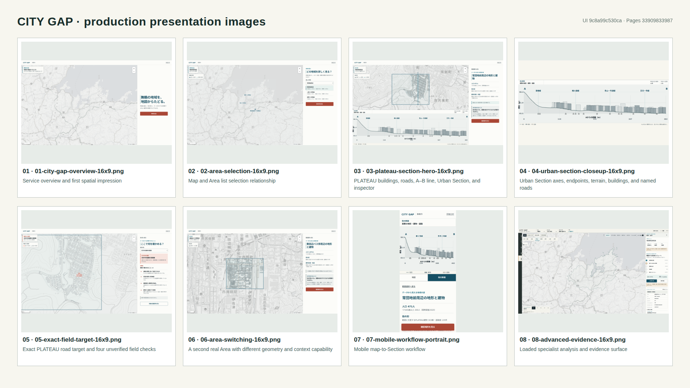

# Presentation assets

Presentation media is evidence derived from a verified production deployment. It is not a substitute for source data, browser tests, or human review.

## Current sets

- `docs/assets/presentation-images/`: current production slide set, contact sheet, and machine-verifiable manifest captured from deployed UI source `9c8a99c530ca375758686c6d6431e76d80c5c748` after Pages run `33909833987`.
- `docs/assets/harbor-atlas-v2/after/`: current automated Harbor Atlas visual checkpoint, including desktop, mobile, DPR2, accessibility, performance, and color-vision evidence.
- `docs/assets/harbor-atlas-v2/before/`: the retained direct comparison baseline for that checkpoint.
- `docs/assets/demo-video/`: current six-file production demo package captured from deployed UI source `9c8a99c530ca375758686c6d6431e76d80c5c748` after Pages run `33909833987`; full captioned, clean, short, poster, captions, and manifest are all present.

The repository does not treat every historical screenshot run as canonical. Superseded packages are recoverable through Git history instead of remaining duplicated in the current checkout.

## Production slide set

The slide set is ordered as a spatial story. Use the first five images in the main narrative, image 07 when explaining responsive use, and images 06 and 08 as appendix evidence unless the audience needs those details earlier.

| File | Intended use | Suggested caption | Placement |
| --- | --- | --- | --- |
| [`01-city-gap-overview-16x9.png`](assets/presentation-images/01-city-gap-overview-16x9.png) | Opening product view | Start with the city, then move from candidates to evidence. | Main |
| [`02-area-selection-16x9.png`](assets/presentation-images/02-area-selection-16x9.png) | Area discovery | The map and ranked Area list keep selection spatially grounded. | Main |
| [`03-plateau-section-hero-16x9.png`](assets/presentation-images/03-plateau-section-hero-16x9.png) | Core spatial evidence | One view connects PLATEAU buildings and roads, the A–B transect, Urban Section, and local context. | Main |
| [`04-urban-section-closeup-16x9.png`](assets/presentation-images/04-urban-section-closeup-16x9.png) | Section explanation | Terrain, buildings, road crossings, endpoints, and named roads remain readable as a presentation figure. | Main |
| [`05-exact-field-target-16x9.png`](assets/presentation-images/05-exact-field-target-16x9.png) | Field handoff | An exact PLATEAU road target turns map evidence into four explicit on-site checks. | Main |
| [`06-area-switching-16x9.png`](assets/presentation-images/06-area-switching-16x9.png) | Breadth of coverage | A second real Area preserves the workflow while changing local geometry and context capability. | Appendix |
| [`07-mobile-workflow-portrait.png`](assets/presentation-images/07-mobile-workflow-portrait.png) | Responsive workflow | The same map-to-Section story remains usable in a real 390 × 844 CSS-pixel mobile viewport at DPR2. | Main or appendix |
| [`08-advanced-evidence-16x9.png`](assets/presentation-images/08-advanced-evidence-16x9.png) | Specialist workflow | Guided context transfers into the loaded Advanced analysis and evidence surface. | Appendix |

The [`manifest.json`](assets/presentation-images/manifest.json) records every state URL, viewport, DPR, selected Area and target, readiness result, diagnostics, SHA-256, production URL, source commit, and Pages run. Landscape assets are 1920 × 1080. The mobile asset is a native 780 × 1688 DPR2 capture. Image 04 is the only derived framing operation: the production Section dock was proportionally scaled and padded, without altering its plotted content.

## Capture policy

1. Build the exact feature-branch commit in production mode.
2. Require the full remote CI matrix to pass before deployment.
3. Deploy that exact commit to GitHub Pages and confirm the Pages run completed successfully.
4. Capture from the production URL with fixed viewport, DPR, reduced motion, font readiness, map readiness, and stable compositor frames.
5. Write new images and video to a temporary directory first.
6. Reject output with browser diagnostics, same-origin HTTP failures, wrong state, missing target/Section data, more than one map initialization, overflow, or provenance mismatch.
7. Verify file count, dimensions, codec, duration, captions, temporal content, and SHA-256 before replacing canonical media.
8. Record source commit, production URL, Pages run, tool/runtime versions, state URL, and hashes in a manifest.

## Retention policy

- Keep the current production slide set, its manifest, and one contact sheet.
- Keep one direct visual baseline only when it materially supports comparison.
- Keep the current demo video, clean master, short backup, poster, captions, and manifest.
- Remove palette explorations, duplicate viewport runs, and superseded checkpoint packages after their conclusion is recorded.
- Never delete source/methodology/provenance records, canonical analysis outputs, tests, or a previously canonical video before its replacement passes all gates.

## Claim boundary

A clean capture proves that a particular build rendered a particular automated state. It does not prove that a person understood the scene, preferred its visual design, or could use it successfully in municipal work.
