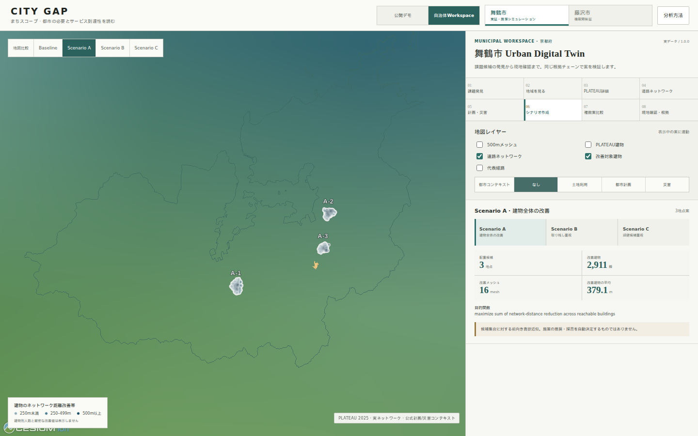

# Municipal scenario workspace contract

CITY GAPのscenario workspaceは、optimizerの出力をそのまま政策決定に変換せず、version固定された案を自治体レビューへ渡す境界です。分析正本はPythonで生成し、同じ7表をcanonical ParquetとPostGISで共有します。この環境ではParquet生成とloader contractのテストまでを行い、PostGISへの投入成功は主張していません。

## Canonical persistence

`analysis.scripts.build_scenario_canonical` は検証済み30案を次へ正規化します。

| table | 実データ行数 | 内容 |
|---|---:|---|
| `scenario_runs` | 30 | city、dataset、PLATEAU、network、context、algorithm、objective、地点数、runtime、status |
| `scenario_sites` | 90 | 選択候補、road/node/GML、座標、connector、feasibility境界 |
| `scenario_objectives` | 155 | 選択目的と独立した評価軸。balancedのvectorをmetadataで保持 |
| `scenario_constraints` | 630 | 1,500m間隔、claim boundary、6種のreview flag |
| `scenario_impacts` | 390 | 建物、距離、高齢者推計、worst-served、robust、到達不能変化 |
| `scenario_context` | 450 | land use、planning、hazard、terrain、road source |
| `scenario_evidence` | 30 | 代表建物から仮想siteまでのEvidence Chain |

各runは2025年舞鶴市archive SHA-256、PLATEAU標準製品仕様5.0、network version、context algorithm/config hash、scenario config hashを明示します。「最新version」は暗黙選択しません。1地点は`exact`、2〜5地点は`deterministic_greedy_approximation`です。初期statusは必ず`draft`です。

```bash
python -m analysis.scripts.build_scenario_canonical
python -m analysis.scripts.load_scenarios_postgis \
  --database-url "$CITYGAP_DATABASE_URL"
```

後者はmigration 001〜005を適用し、同一dataset/network/context versionを投入済みのDBだけで実行します。loaderはmanifestの各Parquetについて容量、SHA-256、行数を照合してからtransactionを開始します。

## Lifecycle

```text
draft
  ├─ under_review
  │    ├─ field_check_required
  │    │    ├─ under_review
  │    │    ├─ reviewed
  │    │    └─ archived
  │    ├─ reviewed
  │    └─ archived
  └─ archived

reviewed ─ under_review / archived
archived ─ terminal
```

`draft → reviewed`の一括遷移は禁止します。遷移はAPIで期待中statusを指定する明示操作であり、optimisation、import、hazard flagが自動実行することはありません。全遷移は`scenario_lifecycle_events`へ記録します。

## Field check

各siteには次を`unknown / confirmed / attention / not_applicable`で保存できます。

- site access
- road safety
- land ownership unknown
- existing service
- facility condition
- hazard confirmation
- operator consultation
- notes

これは人手の観察記録です。`attention`を不適格へ、`confirmed`を承認へ自動変換しません。

## API

| method | path | boundary |
|---|---|---|
| GET | `/cities/{city_id}/scenarios` | status filter、最大100件 |
| GET | `/cities/{city_id}/scenarios/{scenario_id}` | version・site・objective・impact・context・evidence |
| GET | `/cities/{city_id}/scenario-comparison?scenario_ids=A,B,C` | 2〜3案、recommendationは常にnull |
| PATCH | `/cities/{city_id}/scenarios/{scenario_id}/status` | expected/proposed statusによる明示遷移 |
| GET/PUT | `/cities/{city_id}/scenarios/{scenario_id}/sites/{site_order}/field-check` | 人手checklist |

比較APIは最大3案に制限し、overall、worst-served、robust等の異なる目的を横並びにします。単一の謎scoreや自動推奨は返しません。

## Browser workspace

公開画面のヘッダーで `自治体Workspace` を選ぶと、Competition Demoとは独立した業務画面を開きます。静的プレビューはバックエンドを必須にせず、30案の正本から選んだ次の3案だけを配信します。Competition Demoのガイド付きストーリーは従来どおりA/Bだけです。

- Scenario A: `network-overall-3`（建物全体の改善）
- Scenario B: `network-worst_served-3`（取り残し重視）
- Scenario C: `network-robust-3`（頑健候補重視）

Baseline / A / B / Cを地図で切り替え、比較UIはAPIと同じく最大3案までです。藤沢市はregistryの`scenario=unavailable`を表示し、舞鶴市の結果を代用しません。



画面は次の順で解像度を上げます。

1. 500mメッシュで課題候補を発見
2. 地域とPLATEAU建物を確認
3. 実験的道路面ネットワークと代表経路を確認
4. 土地利用・都市計画・災害を候補地点へ重ねる
5. A/B/Cの配置地点と改善範囲を確認
6. 複数案を横並びで比較
7. 7項目の現地確認、コメント、lifecycleを記録
8. JSON / CSV /印刷用Evidenceを出力

地図用`network_scenario_map.geojson`は9候補地点、6代表経路、公式PLATEAUコンテキストを含みます。A/B/C合計7,684件の改善建物位置（案間の重複を含む）と距離改善帯は、識別子を持たない軽量な`network_scenario_building_points.json`へ分離し、案を選んだときだけ分割描画します。建物別の推計人口・推計高齢者数と厳密な距離改善値は公開しません。生成と再検証は次で行います。

```bash
python -m analysis.scripts.build_municipal_workspace_assets
pytest analysis/tests/test_municipal_workspace_assets.py
```

公開プレビューのレビュー状態と現地確認入力はブラウザ内だけの操作です。永続化、履歴、同時更新制御は上記Scenario APIへ接続する運用配備で有効になります。このリポジトリを実行した環境ではPostGIS投入を行っていません。
