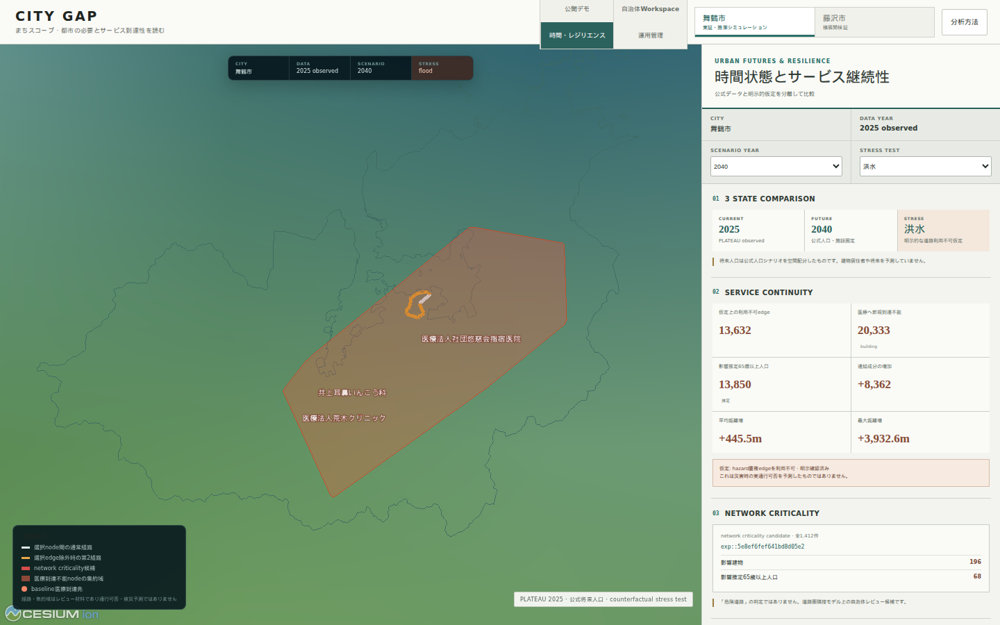

# CITY GAP Urban Futures & Resilience

## What changed

CITY GAP remains the existing Municipal Pilot Platform. The temporal and resilience layer is
additive: the 500 m screening, building allocation, network scenarios, A/B/C municipal review and
public competition story are preserved. The added operating loop is:

```text
OBSERVE current urban state
  -> DETECT versioned changes
  -> DIAGNOSE dependency and spatial impact
  -> STRESS TEST explicit counterfactual assumptions
  -> PLAN compare alternatives and multi-year portfolios
  -> FIELD CHECK selected sites offline
  -> RECORD implemented action
  -> RE-EVALUATE planned effect against a later observed state
```

This is a traceable spatial-computation platform. It does not add a chatbot, generative policy
recommendations, disaster prediction, road-passability prediction, movement prediction or
synthetic demand forecasts.

## Time-aware architecture

An `urban_state` identifies one city at an effective date and binds exact dataset, network and
analysis versions. Observed, future-fixed-service, scenario and stress-test states share the same
model. A scenario must reference its base state; no endpoint silently selects “latest”.

```text
city + effective date + lifecycle
  -> state_dataset_versions (PLATEAU / population / facility / transport / hazard)
  -> state_network_versions
  -> state_analysis_runs
  -> scenario / stress test / portfolio / outcome
  -> Evidence V3 provenance
```

Lifecycle is `draft -> validated -> current -> superseded -> archived`. A database trigger blocks
promotion to `current` unless source datasets are verified and required state links exist. Future
states require a verified official source; completed stress tests require explicit assumptions and
metrics; outcome evaluation requires a baseline.

See [temporal data governance](temporal-data-governance.md) for matching, incremental recomputation,
quality gates and conflict rules.

## Version difference and incremental recomputation

The difference engine classifies `added`, `removed`, `geometry_changed`, `attribute_changed` and
`unchanged`. It first matches unique `gml:id`; unmatched objects may use a unique normalized
geometry hash plus important-attribute hash. Ambiguous fallback matches are not forced.

Important building attributes include usage, measured height, storeys, floor area and geometry.
Road comparison includes geometry and topology-relevant attributes. Change records retain both
dataset versions, match method, hashes, changed attribute names and geometry for bbox/tile delivery.

The dependency graph maps a changed source to the smallest safe recomputation scope. Building
changes invalidate building allocation and intersecting meshes; road changes invalidate affected
components and downstream accessibility/scenarios; facility changes invalidate potentially
reachable network regions. If scope cannot be proved safe, the planner requests a full rebuild.
Small fixtures independently compare incremental and full results before recording a validation.

Only one official PLATEAU version is registered for each validation city. Therefore the real-data
check is intentionally an identity comparison: Maizuru has 23,437 unchanged road edges and
Fujisawa 71,487, with zero false changes. Annual added/removed/changed counts remain unavailable
until a second official version is registered.

## Official future population

The adapter accepts only verified official series and exact published years. Current validation
uses:

- [IPSS Regional Population Projections for Japan, 2023](https://www.ipss.go.jp/pp-shicyoson/j/shicyoson23/t-page.asp)
  for Maizuru and Fujisawa;
- [Fujisawa municipal population projection](https://www.city.fujisawa.kanagawa.jp/kikaku/shise/kekaku/kakushu/kako/jinkosuikei.html)
  as a second official Fujisawa series.

Available years are 2020, 2025, 2030, 2035, 2040, 2045 and 2050. Published population totals are
allocated using the existing residential-capacity model. Every result is labelled:

```text
official demographic projection + CITY GAP spatial allocation model
official population scenario under fixed service assumptions
```

It is not a prediction of building residents. Under the fixed current-service assumption, the
pipeline reports the projected population associated with existing transport/medical burden
areas. It does not claim that services, behaviour or demand remain unchanged in reality.

## Resilience computation

The disruption engine accepts explicit edge, road-group and area closures plus user-entered
facility/service `open`, `close`, `relocate` and `temporary_unavailable` changes. No real closure is
invented. Hazard stress tests are created only after the user confirms a rule such as “treat roads
overlapping this flood class as unavailable”. Each run persists the source hazard version/classes,
rule, affected edges/buildings, base state, network version, algorithm version and actor.

Metrics include baseline/scenario reachable buildings, newly unreachable buildings, estimated
elderly population disconnected, mean/maximum network-distance increase, critical-facility seed
count, largest component and fragmentation. The UI always states:

> これは災害時の実通行可否を予測したものではありません。

Criticality uses iterative Tarjan bridge analysis with subtree demand/service aggregation,
`O(V+E)`, rather than edge-count times full-city Dijkstra. Selected high-impact candidates are
verified by an independent edge-removal implementation. Results are called `network criticality
candidate`, never dangerous-road designations. Evidence retains the source road identity, network
edge/component, affected buildings, model-estimated elderly population and service reachability
change.

Selected origin/destination pairs use k-shortest simple paths for primary/second-route review.
This does not turn the experimental PLATEAU LOD1 surface-adjacency graph into a validated pedestrian
network.

## Real-data validation

The canonical result is `analysis/outputs/real/urban_futures_validation.json`. It is generated from
official/raw validation assets and explicitly records `generated_from_synthetic_data: false`.

| Measure | Maizuru | Fujisawa |
|---|---:|---:|
| network nodes | 15,684 | 53,658 |
| network edges | 23,437 | 71,487 |
| buildings with network demand | 28,448 | 107,557 |
| criticality candidates | 1,412 | 7,897 |
| criticality runtime (latest tracked run) | 0.422 s | 1.116 s |
| official shelters | 126 | 81 |
| shelter network seeds | 79 | 81 |
| normal shelter-reachable buildings | 28,443 | 107,557 |

Maizuru flood-overlap closure validation explicitly closed 13,632 experimental graph edges. For
medical access, 20,333 buildings became newly unreachable, model-estimated disconnected elderly
population was 13,849.998, mean finite distance increase was 445.548 m, maximum increase was
3,932.571 m and component count increased by 8,362. Landslide and tsunami are also executed as
separate explicit assumptions. Fujisawa performs the same common-core flood validation without
filling missing hazard types.

The top Maizuru criticality candidate (`exp::5e8ef6fef641bd8d05e2`) affects 196 building-demand
records and 67.992 model-estimated elderly population under the tested cut. The top Fujisawa
candidate (`exp::14a31f729f6e78d14f6f`) affects 120 records and 98.0 estimated elderly population.
Both are review candidates, not official risk or road-safety findings.

Official shelter capacity is retained only when published: Maizuru totals 25,884 and Fujisawa
71,797. Maizuru’s median shelter-to-experimental-graph snap is 1,227 m (maximum 8,524 m), so its
reachability result requires municipal network/snap review. Fujisawa’s median is 51.5 m (maximum
142.7 m). Neither result is an evacuation or crowd simulation.

## Planning, portfolio and outcomes

Planning monitoring compares official designations with observed building-use composition and
demographic model totals. Output is `planning-context mismatch candidate`; legal compliance is
always false/not determined. A municipal CSV/GeoJSON target adapter accepts externally supplied
population, service coverage and urban-function targets without creating values.

A policy portfolio holds multiple supported intervention types and explicit implementation years.
Budget constraints activate only when the external cost adapter receives `site_id`, `cost`, `year`
and `category`; no cost is inferred. Implementation status is `planned`, `approved`, `implemented`,
`cancelled` or `unknown`, and approval is never automatic.

Outcome evaluation stores baseline, planned effect and later observed state separately. The report
uses `planned effect` and `observed change`; `causal_effect_claimed` is permanently false.

## Field mode and public boundary

The PWA caches only a planner-selected site package: map context, PLATEAU/network attributes,
checklist and evidence summary. IndexedDB holds selected packages and a local operation queue.
Notes, checklist status and GPS confirmation synchronize when connectivity returns.

Every field record has version, actor and timezone-aware update time. A stale base version returns
HTTP 409 and an unresolved conflict. The municipality must explicitly choose server, client or a
merged state; silent last-write-wins is prohibited.

GitHub Pages contains only reviewed aggregate resilience results. It contains no building-level
estimated demographic values. The new workspace compares at most three states and clearly displays
City, Data year, Scenario year and Stress test. The existing eight-step competition story is not
expanded; the resilience story is an optional presentation route.



## API and persistence

Temporal/resilience routes are bounded and version-explicit:

- `GET /cities/{city_id}/states` and `/states/{state_id}`
- `GET /cities/{city_id}/state-comparison` and `/changes?bbox=...`
- `POST /cities/{city_id}/stress-tests`
- `GET /stress-tests/{id}` and `/impacts?bbox=...&limit=...`
- `GET /cities/{city_id}/network/criticality`
- `GET /cities/{city_id}/future-states`
- `GET /cities/{city_id}/outcomes`
- selected-site offline-package, sync and conflict-resolution routes

Migrations 011–013 add temporal state/diff/recomputation, resilience persistence/cache/precompute,
future population, planning targets, portfolios, implementation/outcomes, field sync, Evidence V3
and annual reports. Worker stages include dataset diff, incremental recomputation, future
population, stress test, criticality and outcome evaluation. Analyst creates analyses/stress tests;
planner reviews scenarios/outcomes and field sync; admin retains version control.

Evidence V3 is deterministic JSON, CSV and print HTML. It links result -> urban state -> dataset
versions -> PLATEAU/network version -> scenario/stress-test assumption -> algorithm and limitations.

## Reproduce

```bash
python -m analysis.scripts.build_urban_futures_validation
python -m analysis.scripts.benchmark_urban_resilience_scale
python -m analysis.scripts.build_evidence_v3
python -m analysis.scripts.build_platform_registry
pytest

cd frontend
npm test
npm run lint
npm run typecheck
npm run build
npm run preview
npm run audit:futures
```

The 100k/250k/500k benchmark is a synthetic ring fixture and is never presented as real municipal
data or a production SLA. See [performance](performance.md).
